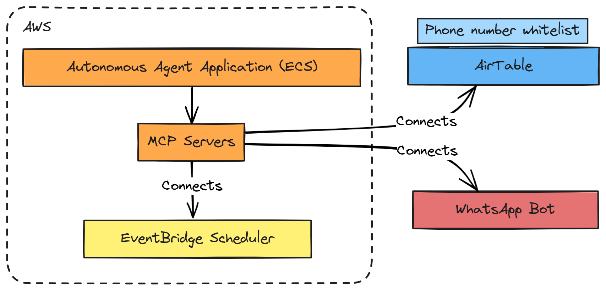
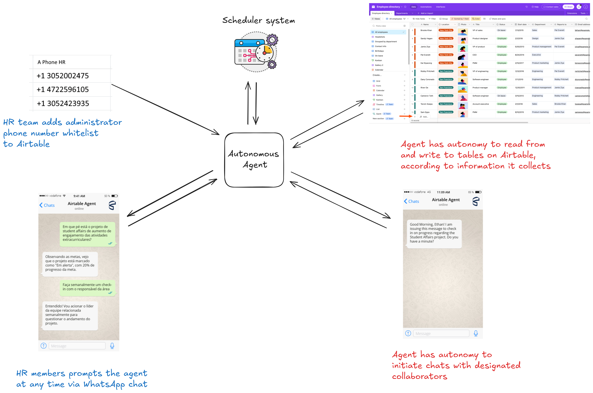

# Airtable WhatsApp Agent

Agent for monitoring business processes via Airtable, capable of sending messages to employees on WhatsApp, using AWS EventBridge for internal task scheduling.





## 🚀 Quick Start

### Prerequisites

- Python 3.9+
- Docker and Docker Compose
- AWS CLI (for cloud deployment)
- WhatsApp Business API access
- Airtable account and API key

### Local Development Setup

1. **Clone the repository**
   ```bash
   git clone https://github.com/your-username/Airtable-Whatsapp-Agent.git
   cd Airtable-Whatsapp-Agent
   ```

2. **Set up environment variables**
   ```bash
   cp .env.example .env
   # Edit .env with your actual credentials
   ```

3. **Install dependencies**
   ```bash
   pip install -r requirements.txt
   ```

4. **Run with Docker Compose**
   ```bash
   docker-compose up -d
   ```

The application will be available at `http://localhost:8000`

## 📋 Configuration

### Environment Variables

Copy `.env.example` to `.env` and configure the required environment variables.

## 🔌 MCP (Model Context Protocol) Architecture

This application uses external MCP servers for enhanced modularity and maintainability:

### External MCP Servers

- **WhatsApp MCP Server**: Handles WhatsApp Business API integration
  - Uses public `whatsapp-mcp` server
  - Supports message sending, receiving, and status tracking
  - Configured via `MCP_WHATSAPP_SERVER_URL`

- **Airtable MCP Server**: Manages Airtable database operations
  - Uses public `@domdomegg/airtable-mcp-server`
  - Handles table operations, record management, and queries
  - Configured via `MCP_AIRTABLE_SERVER_URL`

### MCP Configuration

```env
# MCP Server URLs
MCP_AIRTABLE_SERVER_URL=http://airtable-mcp:8000
MCP_WHATSAPP_SERVER_URL=http://whatsapp-mcp:8001
MCP_TIMEOUT_SECONDS=30
MCP_MAX_RETRIES=3
MCP_RETRY_DELAY=1.0
```

### Benefits

- **Modularity**: Each service handles specific functionality
- **Scalability**: MCP servers can be scaled independently
- **Maintainability**: Updates to MCP servers don't require application changes
- **Reliability**: Built-in retry logic and error handling

## 🐳 Docker Deployment

### Local Development

```bash
# Start all services
docker-compose up -d

# View logs
docker-compose logs -f

# Stop services
docker-compose down
```

### Production Deployment

```bash
# Use production configuration
docker-compose -f docker-compose.prod.yml up -d
```

## ☁️ AWS ECS Deployment

### 1. Create ECR Repository

```bash
aws ecr create-repository --repository-name airtable-whatsapp-agent --region us-east-2
```

### 2. Build and Push Docker Image

```bash
# Get login token
aws ecr get-login-password --region us-east-2 | docker login --username AWS --password-stdin YOUR_ACCOUNT_ID.dkr.ecr.us-east-2.amazonaws.com

# Build image
docker build -t airtable-whatsapp-agent .

# Tag image
docker tag airtable-whatsapp-agent:latest YOUR_ACCOUNT_ID.dkr.ecr.us-east-2.amazonaws.com/airtable-whatsapp-agent:latest

# Push image
docker push YOUR_ACCOUNT_ID.dkr.ecr.us-east-2.amazonaws.com/airtable-whatsapp-agent:latest
```

### 3. Set Up AWS Secrets Manager

Store sensitive configuration in AWS Secrets Manager for security, do it according to the secrets required by ecs-task-definition.json

### 4. Create IAM Roles

#### Task Execution Role

```bash
# Create the execution role
aws iam create-role \
    --role-name ecsTaskExecutionRole \
    --assume-role-policy-document file://policies/trust-policy.json

# Attach AWS managed policy
aws iam attach-role-policy \
    --role-name ecsTaskExecutionRole \
    --policy-arn arn:aws:iam::aws:policy/service-role/AmazonECSTaskExecutionRolePolicy

# Create and attach custom policy for secrets access
aws iam create-policy \
    --policy-name AirtableWhatsAppAgentSecretsPolicy \
    --policy-document file://policies/iam-task-execution-role-policy.json

aws iam attach-role-policy \
    --role-name ecsTaskExecutionRole \
    --policy-arn arn:aws:iam::YOUR_ACCOUNT_ID:policy/AirtableWhatsAppAgentSecretsPolicy
```

#### Task Role (for application permissions)

```bash
# Create task role
aws iam create-role \
    --role-name airtable-whatsapp-agent-task-role \
    --assume-role-policy-document file://policies/trust-policy.json

# Create and attach application policy
aws iam create-policy \
    --policy-name AirtableWhatsAppAgentTaskPolicy \
    --policy-document file://policies/iam-task-role-policy.json

aws iam attach-role-policy \
    --role-name airtable-whatsapp-agent-task-role \
    --policy-arn arn:aws:iam::YOUR_ACCOUNT_ID:policy/AirtableWhatsAppAgentTaskPolicy
```

### 5. Create CloudWatch Log Group

```bash
aws logs create-log-group \
    --log-group-name /ecs/airtable-whatsapp-agent \
    --region us-east-2
```

### 6. Create ECS Cluster

```bash
aws ecs create-cluster \
    --cluster-name airtable-whatsapp-agent-cluster \
    --region us-east-2
```

### 7. Register Task Definition

Update the task definition file with your account ID and register it:

```bash
# Update YOUR_ACCOUNT_ID in ecs-task-definition.json
sed -i 's/YOUR_ACCOUNT_ID/123456789012/g' ecs-task-definition.json

# Register the task definition
aws ecs register-task-definition \
    --cli-input-json file://ecs-task-definition.json \
    --region us-east-2
```

### 8. Create Application Load Balancer

```bash
# Create ALB
aws elbv2 create-load-balancer \
    --name airtable-whatsapp-agent-alb \
    --subnets subnet-12345678 subnet-87654321 \
    --security-groups sg-12345678 \
    --region us-east-2

# Create target group
aws elbv2 create-target-group \
    --name airtable-whatsapp-agent-tg \
    --protocol HTTP \
    --port 80 \
    --vpc-id vpc-12345678 \
    --target-type ip \
    --health-check-path /health \
    --region us-east-2

# Create listener
aws elbv2 create-listener \
    --load-balancer-arn arn:aws:elasticloadbalancing:us-east-2:YOUR_ACCOUNT_ID:loadbalancer/app/airtable-whatsapp-agent-alb/1234567890123456 \
    --protocol HTTP \
    --port 80 \
    --default-actions Type=forward,TargetGroupArn=arn:aws:elasticloadbalancing:us-east-2:YOUR_ACCOUNT_ID:targetgroup/airtable-whatsapp-agent-tg/1234567890123456 \
    --region us-east-2
```

### 9. Create ECS Service

```bash
aws ecs create-service \
    --cluster airtable-whatsapp-agent-cluster \
    --service-name airtable-whatsapp-agent-service \
    --task-definition airtable-whatsapp-agent:1 \
    --enable-execute-command \
    --desired-count 1 \
    --launch-type FARGATE \
    --network-configuration "awsvpcConfiguration={subnets=[subnet-12345678,subnet-87654321],securityGroups=[sg-12345678],assignPublicIp=ENABLED}" \
    --load-balancers targetGroupArn=arn:aws:elasticloadbalancing:us-east-2:YOUR_ACCOUNT_ID:targetgroup/airtable-whatsapp-agent-tg/1234567890123456,containerName=airtable-whatsapp-agent,containerPort=80 \
    --region us-east-2
```

### 10. Update Secrets with Actual Domain

```bash
# Get ALB DNS name
ALB_DNS=$(aws elbv2 describe-load-balancers \
    --names airtable-whatsapp-agent-alb \
    --query 'LoadBalancers[0].DNSName' \
    --output text \
    --region us-east-2)

# Update webhook URL secret
aws secretsmanager update-secret \
    --secret-id "airtable-whatsapp-agent:WHATSAPP_WEBHOOK_URL::" \
    --secret-string "https://${ALB_DNS}/api/v1/webhooks/whatsapp" \
    --region us-east-2

# Update CORS origins
aws secretsmanager update-secret \
    --secret-id "airtable-whatsapp-agent:CORS_ORIGINS::" \
    --secret-string "[\"https://${ALB_DNS}\"]" \
    --region us-east-2
```

## 📊 Monitoring

### Health Checks

- **Application Health**: `GET /health`
- **Detailed Health**: `GET /health/detailed`
- **Metrics**: `GET /metrics` (Prometheus format)

### Logging

Logs are structured and include:
- Request/response tracking
- Error details with context
- Performance metrics
- Security events

### Monitoring Endpoints

```bash
# Check application health
curl http://localhost:8000/health

# Get detailed component status
curl http://localhost:8000/health/detailed

# View metrics (Prometheus format)
curl http://localhost:8000/metrics
```

### Logs and Debugging

```bash
# View application logs
docker-compose logs -f app

# View all service logs
docker-compose logs -f

# Debug mode (local development)
AIRTABLE_WHATSAPP_DEBUG=true python -m uvicorn src.airtable_whatsapp_agent.api.main:app --reload
```